# Documentation of my ML journey 
## Machine Learning from A - Z course by Kirill Eremenko and Hadelin de Ponteves
### Topics covered so far:
#### Data preprocessing
- Splitting dataset for testing and training
- Feature scaling
- Taking care of missing values
- Encoding categorical data
#### Regression
- Simple linear regression
- Multiple linear regression
- Polynomial regression
- Support Vector Regression
- Decision trees
- Random forest regression
- Evaluation using R^2
#### Classification
- Logistic regression
- K Nearest Neighbor (KNN)
- Support Vector Machine (SVM)
- Kernel SVM
- Naive Bayes
- Decision trees
- Random forest

#### Clustering
- Kmeans
- K++
- Hierarchical Clustering

#### Association Rule learning
- Apriori
- Eclat

#### Reinforcement Learner
- Upper Confidence Bound
- Thompson sampling

#### Natural Language Processing
- Bag of words model

#### Deep learning
- Artificial Neural Network (ANN)
- Convolution Neural Networks (CNN)

#### Dimensionality reduction
- Principle Component Analysis (PCA)
- Linear Discriminant Analysis (LDA)

#### Model Selection 
- K-fold cross validation
- Grid search

#### XGBoost

### Tech used
- Python
  - Pandas
  - Numpy
  - Matplotlib
  - ScikitLearn
      - preprocessing
      - imputer
      - tree
      - 
- NLTK
- Tensorflow
- Keras
- Google Colab


# Computer Vision (kudos to CS231n <3)
**Image Classification problem**: is the task of assigning an input image one label from a fixed set of categories.

The *inexhaustive list of challenges* involved from the perspective of a Computer Vision algorithm:
- Viewpoint variation. A single instance of an object can be oriented in many ways with respect to the camera.
- Scale variation. Visual classes often exhibit variation in their size (size in the real world, not only in terms of their extent in the image).
- Deformation. Many objects of interest are not rigid bodies and can be deformed in extreme ways.
- Occlusion. The objects of interest can be occluded. Sometimes only a small portion of an object (as little as few pixels) could be visible.
- Illumination conditions. The effects of illumination are drastic on the pixel level.
- Background clutter. The objects of interest may blend into their environment, making them hard to identify.
- Intra-class variation. The classes of interest can often be relatively broad, such as chair. There are many different types of these objects, each with their own appearance.

A good image classification model must be invariant to the cross product of all these variations, while simultaneously retaining sensitivity to the inter-class variations.


The **image classification pipeline**. We’ve seen that the task in Image Classification is to take an array of pixels that represents a single image and assign a label to it. Our complete pipeline can be formalized as follows:

- *Input*: Our input consists of a set of N images, each labeled with one of K different classes. We refer to this data as the training set.
- *Learning*: Our task is to use the training set to learn what every one of the classes looks like. We refer to this step as training a classifier, or learning a model.
- *Evaluation*: In the end, we evaluate the quality of the classifier by asking it to predict labels for a new set of images that it has never seen before. We will then compare the true labels of these images to the ones predicted by the classifier. Intuitively, we’re hoping that a lot of the predictions match up with the true answers (which we call the ground truth).

## Nearest Neighbor Classifier
As our first approach, we will develop what we call a Nearest Neighbor Classifier. This classifier has nothing to do with Convolutional Neural Networks and it is very rarely used in practice, but it will allow us to get an idea about the basic approach to an image classification problem.

Example image classification dataset: [*CIFAR-10*](https://www.cs.toronto.edu/~kriz/cifar.html). This dataset consists of 60,000 tiny images that are 32 pixels high and wide. Each image is labeled with one of 10 classes (for example “airplane, automobile, bird, etc”). These 60,000 images are partitioned into a training set of 50,000 images and a test set of 10,000 images. 

The nearest neighbor classifier will take a test image, compare it to every single one of the training images, and predict the label of the closest training image.
A reasonable choice for comparing them might be the L1 distance
An example of using pixel-wise differences to compare two images with L1 distance. Two images are subtracted elementwise and then all differences are added up to a single number. If two images are identical the result will be zero. But if the images are very different the result will be large.


**As an evaluation criterion, it is common to use the accuracy, which measures the fraction of predictions that were correct.**


There are many other ways of computing distances between vectors. Another common choice could be to instead use the L2 distance, which has the geometric interpretation of computing the euclidean distance between two vectors
```
distances = np.sqrt(np.sum(np.square(self.Xtr - X[i,:]), axis = 1))
```
we could leave out the square root operation because square root is a monotonic function.
The choices such as choosing between L1 and L2 norm are called *hyperparameters* and tweaking them to see what works best is fine but must not be done on the test set. Instead grab a subset of test set (validation set) and use it to tune hyperparameters.  

## k - Nearest Neighbor Classifier
The idea is very simple: instead of finding the single closest image in the training set, we will find the top k closest images, and have them vote on the label of the test image. In particular, when k = 1, we recover the Nearest Neighbor classifier. 

**Evaluate on the test set only a single time, at the very end.**

**Cross-validation**. In cases where the size of your training data (and therefore also the validation data) might be small, people sometimes use a more sophisticated technique for hyperparameter tuning called cross-validation.
You can get a better and less noisy estimate of how well a certain value of k works by iterating over different validation sets and averaging the performance across these. For example, in 5-fold cross-validation, we would split the training data into 5 equal folds, use 4 of them for training, and 1 for validation. We would then iterate over which fold is the validation fold, evaluate the performance, and finally average the performance across the different folds.

In practice, *people prefer to avoid cross-validation* in favor of having a single validation split, since cross-validation can be computationally expensive. The splits people tend to use is between 50%-90% of the training data for training and rest for validation. However, this depends on multiple factors: For example if the number of hyperparameters is large you may prefer to use bigger validation splits. If the number of examples in the validation set is small (perhaps only a few hundred or so), it is safer to use cross-validation. Typical number of folds you can see in practice would be 3-fold, 5-fold or 10-fold cross-validation.

### Pros and Cons of Nearest Neighbor classifier.

- One advantage is that it is very simple to implement and understand. Additionally, the classifier takes no time to train, since all that is required is to store and possibly index the training data. 

- However, we pay that computational cost at test time, since classifying a test example requires a comparison to every single training example. This is backwards, since in practice we often care about the test time efficiency much more than the efficiency at training time. In fact, the deep neural networks we will develop later in this class shift this tradeoff to the other extreme: They are very expensive to train, but once the training is finished it is very cheap to classify a new test example. This mode of operation is much more desirable in practice.

As an aside, the computational complexity of the Nearest Neighbor classifier is an active area of research, and several Approximate Nearest Neighbor (ANN) algorithms and libraries exist that can accelerate the nearest neighbor lookup in a dataset (e.g. FLANN). These algorithms allow one to trade off the correctness of the nearest neighbor retrieval with its space/time complexity during retrieval, and usually rely on a pre-processing/indexing stage that involves building a kdtree, or running the k-means algorithm.

The Nearest Neighbor Classifier may sometimes be a good choice in some settings (especially if the data is low-dimensional), but it is rarely appropriate for use in practical image classification settings. One problem is that images are high-dimensional objects (i.e. they often contain many pixels), and distances over high-dimensional spaces can be very counter-intuitive.

Additional reading: 
- [A Few Useful Things to Know About Machine Learning](https://homes.cs.washington.edu/~pedrod/papers/cacm12.pdf)
- [Recognizing and Learning Object Categories](https://people.csail.mit.edu/torralba/shortCourseRLOC/index.html)


[Lecture 2](https://cs231n.github.io/linear-classify/)
We are now going to develop a more powerful approach to image classification that we will eventually naturally extend to entire Neural Networks and Convolutional Neural Networks. The approach will have two major components: a **score function** that maps the raw data to class scores, and a **loss function** that quantifies the agreement between the predicted scores and the ground truth labels. We will then cast this as an optimization problem in which we will minimize the loss function with respect to the parameters of the score function.

## Parameterized mapping from images to label scores
The first component of this approach is to define the score function that maps the pixel values of an image to confidence scores for each class.

### Linear classifier
We will start out with arguably the simplest possible function, a linear mapping:
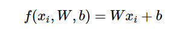

In the above equation, we are assuming that the image xi
has all of its pixels flattened out to a single column vector of shape [D x 1]. The matrix W (of size [K x D]), and the vector b (of size [K x 1]) are the parameters of the function. In CIFAR-10, xi
contains all pixels in the i-th image flattened into a single [3072 x 1] column, W is [10 x 3072] and b is [10 x 1], so 3072 numbers come into the function (the raw pixel values) and 10 numbers come out (the class scores). The parameters in W are often called the weights, and b is called the bias vector because it influences the output scores, but without interacting with the actual data xi. 
 
However, you will often hear people use the terms weights and parameters interchangeably.

### Interpreting a linear classifier
Notice that a linear classifier computes the score of a class as a weighted sum of all of its pixel values across all 3 of its color channels. Depending on precisely what values we set for these weights, the function has the capacity to like or dislike (depending on the sign of each weight) certain colors at certain positions in the image. For instance, you can imagine that the “ship” class might be more likely if there is a lot of blue on the sides of an image (which could likely correspond to water). You might expect that the “ship” classifier would then have a lot of positive weights across its blue channel weights (presence of blue increases score of ship), and negative weights in the red/green channels (presence of red/green decreases the score of ship).


**Image data preprocessing** 
As a quick note, in the examples above we used the raw pixel values (which range from [0…255]). In Machine Learning, it is a very common practice to always perform normalization of your input features (in the case of images, every pixel is thought of as a feature). In particular, it is important to center your data by subtracting the mean from every feature. In the case of images, this corresponds to computing a mean image across the training images and subtracting it from every image to get images where the pixels range from approximately [-127 … 127]. Further common preprocessing is to scale each input feature so that its values range from [-1, 1]. Of these, zero mean centering is arguably more important but we will have to wait for its justification until we understand the dynamics of gradient descent.

## Loss function
We are going to measure our unhappiness with outcomes such as this one with a loss function (or sometimes also referred to as the cost function or the objective). Intuitively, the loss will be high if we’re doing a poor job of classifying the training data, and it will be low if we’re doing well.

There are several ways to define the details of the loss function.

### Multiclass Support Vector Machine loss
As a first example we will first develop a commonly used loss called the Multiclass Support Vector Machine (SVM) loss. The SVM loss is set up so that the SVM “wants” the correct class for each image to a have a score higher than the incorrect classes by some fixed margin Δ.

It’s sometimes helpful to *anthropomorphise* the loss functions as we did above: *The SVM “wants” a certain outcome in the sense that the outcome would yield a lower loss (which is good)*.

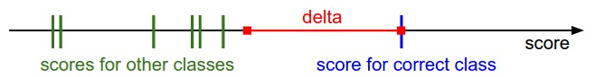

Any additional difference above the margin is clamped at zero with the max operation.

the threshold at zero max(0,−) function is often called the hinge loss. You’ll sometimes hear about people instead using the squared hinge loss SVM (or L2-SVM), which uses the form max(0,−)^2 that penalizes violated margins more strongly (quadratically instead of linearly). The unsquared version is more standard, but in some datasets the squared hinge loss can work better. This can be determined during *cross-validation*.

The Multiclass Support Vector Machine "wants" the score of the correct class to be higher than all other scores by at least a margin of delta. If any class has a score inside the red region (or higher), then there will be accumulated loss. Otherwise the loss will be zero. Our objective will be to find the weights that will simultaneously satisfy this constraint for all examples in the training data and give a total loss that is as low as possible.


Regularization. There is one bug with the loss function we presented above. Suppose that we have a dataset and a set of parameters W that correctly classify every example (i.e. all scores are so that all the margins are met, and Li=0
for all i). The issue is that this set of W is not necessarily unique: there might be many similar W that correctly classify the examples. One easy way to see this is that if some parameters W correctly classify all examples (so loss is zero for each example), then any multiple of these parameters λW where λ>1 will also give zero loss because this transformation uniformly stretches all score magnitudes and hence also their absolute differences. For example, if the difference in scores between a correct class and a nearest incorrect class was 15, then multiplying all elements of W by 2 would make the new difference 30.

In other words, we wish to encode some preference for a certain set of weights W over others to remove this ambiguity. We can do so by extending the loss function with a regularization penalty R(W)
. The most common regularization penalty is the squared L2 norm that discourages large weights through an elementwise quadratic penalty over all parameters:
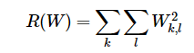

In the expression above, we are summing up all the squared elements of W. Notice that the regularization function is not a function of the data, it is only based on the weights. Including the regularization penalty completes the full Multiclass Support Vector Machine loss, which is made up of two components: the data loss (which is the average loss Li over all examples) and the regularization loss. That is, the full Multiclass SVM loss becomes:
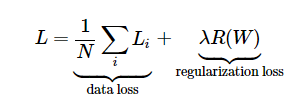

========== More in the lecture ========== 
### Softmax classifier
The other popular choice for classifier is the Softmax classifier, which has a different loss function.

Softmax classifier is the generalization of the binary Logistic Regression classifier to multiple classes

Unlike the SVM which treats the outputs f(x~i~,W) as (uncalibrated and possibly difficult to interpret) scores for each class, the Softmax classifier gives a slightly more intuitive output (normalized class probabilities) and also has a probabilistic interpretation that we will describe shortly. In the Softmax classifier, the function mapping f(x~i~;W)=Wx~i~ stays unchanged, but we now interpret these scores as the unnormalized log probabilities for each class and replace the hinge loss with a cross-entropy loss that has the form:
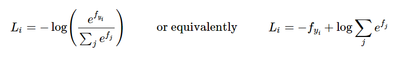
where we are using the notation f~j~ to mean the j-th element of the vector of class scores f.

As before, the full loss for the dataset is the mean of L~i~ over all training examples together with a regularization term R(W). The function 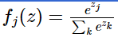   is called the softmax function: It takes a vector of arbitrary real-valued scores (in z
) and squashes it to a vector of values between zero and one that sum to one.
The Softmax classifier is hence minimizing the cross-entropy between the estimated class probabilities 

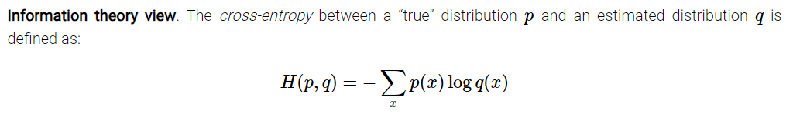

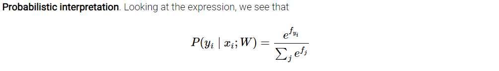

========== more inlecture ==========
[Interactive web demo](http://vision.stanford.edu/teaching/cs231n-demos/linear-classify/)


### Backpropagation


### Neural networks

### Modularity: Sigmoid example

### Patterns in backward flow
- add: gradient distributor

- multipliy: gradient switcher
- max: gradient router

back propagated to only the largest of the inputs at the node
### Gradients for vectorized operations

**Additional resources**:
- [deeplearning.net](http://www.deeplearning.net/tutorial/mlp.html) tutorial with Theano
- [ConvNetJS demos](https://cs.stanford.edu/people/karpathy/convnetjs/) for intuitions
- [Michael Nielsen’s](http://neuralnetworksanddeeplearning.com/chap1.html) tutorials


### Setting up the data and the model
There are three common forms of data preprocessing a data matrix X, where we will assume that X is of size [N x D] (N is the number of data, D is their dimensionality).

**Mean subtraction** is the most common form of preprocessing. It involves subtracting the mean across every individual feature in the data, and has the geometric interpretation of centering the cloud of data around the origin along every dimension. In numpy, this operation would be implemented as: X -= np.mean(X, axis = 0). With images specifically, for convenience it can be common to subtract a single value from all pixels (e.g. X -= np.mean(X)), or to do so separately across the three color channels.

**Normalization** refers to normalizing the data dimensions so that they are of approximately the same scale. There are two common ways of achieving this normalization. One is to divide each dimension by its standard deviation, once it has been zero-centered: (X /= np.std(X, axis = 0)). Another form of this preprocessing normalizes each dimension so that the min and max along the dimension is -1 and 1 respectively. It only makes sense to apply this preprocessing if you have a reason to believe that different input features have different scales (or units), but they should be of approximately equal importance to the learning algorithm. In case of images, the relative scales of pixels are already approximately equal (and in range from 0 to 255), so it is not strictly necessary to perform this additional preprocessing step.

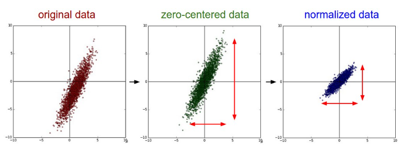

**PCA and Whitening (these transformations are not used with Convolutional Networks.)** is another form of preprocessing. In this process, the data is first centered as described above. Then, we can compute the covariance matrix that tells us about the correlation structure in the data:

```# Assume input data matrix X of size [N x D]
X -= np.mean(X, axis = 0) # zero-center the data (important)
cov = np.dot(X.T, X) / X.shape[0] # get the data covariance matrix
```

The (i,j) element of the data covariance matrix contains the covariance between i-th and j-th dimension of the data. In particular, the diagonal of this matrix contains the variances. Furthermore, the covariance matrix is symmetric and positive semi-definite. We can compute the SVD factorization of the data covariance matrix:

```
U,S,V = np.linalg.svd(cov)
```

where the columns of U are the eigenvectors and S is a 1-D array of the singular values. To decorrelate the data, we project the original (but zero-centered) data into the eigenbasis:

```
Xrot = np.dot(X, U) # decorrelate the data
```

Notice that the columns of U are a set of orthonormal vectors (norm of 1, and orthogonal to each other), so they can be regarded as basis vectors. The projection therefore corresponds to a rotation of the data in X so that the new axes are the eigenvectors. If we were to compute the covariance matrix of Xrot, we would see that it is now diagonal. A nice property of np.linalg.svd is that in its returned value U, the eigenvector columns are sorted by their eigenvalues. We can use this to reduce the dimensionality of the data by only using the top few eigenvectors, and discarding the dimensions along which the data has no variance. This is also sometimes referred to as [Principal Component Analysis (PCA) dimensionality](https://en.wikipedia.org/wiki/Principal_component_analysis) reduction:

```
Xrot_reduced = np.dot(X, U[:,:100]) # Xrot_reduced becomes [N x 100]
```

After this operation, we would have reduced the original dataset of size [N x D] to one of size [N x 100], *keeping the 100 dimensions of the data that contain the most variance*. It is very often the case that you can get very good performance by training linear classifiers or neural networks on the PCA-reduced datasets, obtaining savings in both space and time.

The last transformation you may see in practice is **whitening**. The whitening operation takes the data in the eigenbasis and divides every dimension by the eigenvalue to normalize the scale. The geometric interpretation of this transformation is that if the input data is a multivariable gaussian, then the whitened data will be a gaussian with zero mean and identity covariance matrix. This step would take the form:

```
# whiten the data:
# divide by the eigenvalues (which are square roots of the singular values)
Xwhite = Xrot / np.sqrt(S + 1e-5)
```

Warning: Exaggerating noise. Note that we’re adding 1e-5 (or a small constant) to prevent division by zero. One weakness of this transformation is that it can greatly exaggerate the noise in the data, since it stretches all dimensions (including the irrelevant dimensions of tiny variance that are mostly noise) to be of equal size in the input. This can in practice be mitigated by stronger smoothing (i.e. increasing 1e-5 to be a larger number).

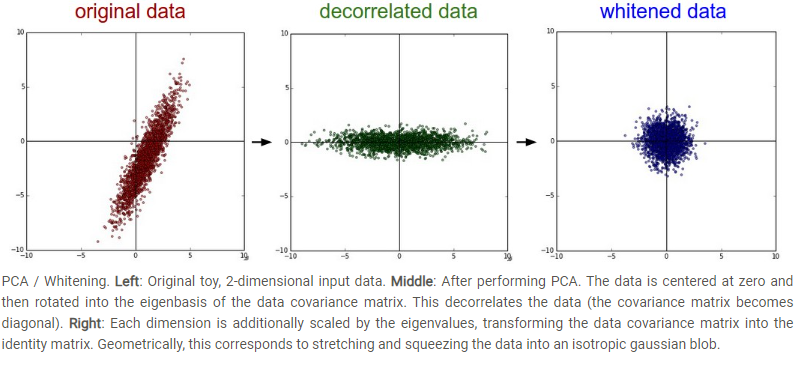

**Common pitfall**. An important point to make about the preprocessing is that any preprocessing statistics (e.g. the data mean) must only be computed on the training data, and then applied to the validation / test data. E.g. computing the mean and subtracting it from every image across the entire dataset and then splitting the data into train/val/test splits would be a mistake. Instead, the mean must be computed only over the training data and then subtracted equally from all splits (train/val/test).

### Weight Initialization

We have seen how to construct a Neural Network architecture, and how to preprocess the data. Before we can begin to train the network we have to initialize its parameters.

**Pitfall: all zero initialization.** Lets start with what we should not do. Note that we do not know what the final value of every weight should be in the trained network, but with proper data normalization it is reasonable to assume that approximately half of the weights will be positive and half of them will be negative. A reasonable-sounding idea then might be to set all the initial weights to zero, which we expect to be the “best guess” in expectation. This turns out to be a mistake, because if every neuron in the network computes the same output, then they will also all compute the same gradients during backpropagation and undergo the exact same parameter updates. In other words, there is no source of asymmetry between neurons if their weights are initialized to be the same.

**Small random numbers.** Therefore, we still want the weights to be very close to zero, but as we have argued above, not identically zero. As a solution, it is common to initialize the weights of the neurons to small numbers and refer to doing so as symmetry breaking. The idea is that the neurons are all random and unique in the beginning, so they will compute distinct updates and integrate themselves as diverse parts of the full network. The implementation for one weight matrix might look like W = 0.01* np.random.randn(D,H), where randn samples from a zero mean, unit standard deviation gaussian. With this formulation, every neuron’s weight vector is initialized as a random vector sampled from a multi-dimensional gaussian, so the neurons point in random direction in the input space. It is also possible to use small numbers drawn from a uniform distribution, but this seems to have relatively little impact on the final performance in practice.

*Warning: It’s not necessarily the case that smaller numbers will work strictly better. For example, a Neural Network layer that has very small weights will during backpropagation compute very small gradients on its data (since this gradient is proportional to the value of the weights). This could greatly diminish the “gradient signal” flowing backward through a network, and could become a concern for deep networks.*

**Calibrating the variances with 1/sqrt(n).** One problem with the above suggestion is that the distribution of the outputs from a randomly initialized neuron has a variance that grows with the number of inputs. It turns out that we can normalize the variance of each neuron’s output to 1 by scaling its weight vector by the square root of its fan-in (i.e. its number of inputs). That is, the recommended heuristic is to initialize each neuron’s weight vector as: w = np.random.randn(n) / sqrt(n), where n is the number of its inputs. This ensures that all neurons in the network initially have approximately the same output distribution and empirically improves the rate of convergence.

**Sparse initialization.** Another way to address the uncalibrated variances problem is to set all weight matrices to zero, but to break symmetry every neuron is randomly connected (with weights sampled from a small gaussian as above) to a fixed number of neurons below it. A typical number of neurons to connect to may be as small as 10.

**Initializing the biases**. It is possible and common to initialize the biases to be zero, since the asymmetry breaking is provided by the small random numbers in the weights. For ReLU non-linearities, some people like to use small constant value such as 0.01 for all biases because this ensures that all ReLU units fire in the beginning and therefore obtain and propagate some gradient. However, it is not clear if this provides a consistent improvement (in fact some results seem to indicate that this performs worse) and it is more common to simply use 0 bias initialization.

In practice, the **current recommendation** is to use ReLU units and use the w = np.random.randn(n) * sqrt(2.0/n)

**Batch Normalization**. A recently developed technique by Ioffe and Szegedy called Batch Normalization alleviates a lot of headaches with properly initializing neural networks by explicitly forcing the activations throughout a network to take on a unit gaussian distribution at the beginning of the training. The core observation is that this is possible because normalization is a simple differentiable operation. In the implementation, applying this technique usually amounts to insert the BatchNorm layer immediately after fully connected layers (or convolutional layers, as we’ll soon see), and before non-linearities. We do not expand on this technique here because it is well described in the linked paper, but note that it has become a very common practice to use Batch Normalization in neural networks. In practice networks that use Batch Normalization are significantly more robust to bad initialization. Additionally, batch normalization can be interpreted as doing preprocessing at every layer of the network, but integrated into the network itself in a differentiable manner. Neat!

### Regularization

There are several ways of controlling the capacity of Neural Networks to prevent *overfitting:*

- L2 regularization 
- L1 regularization 
- Max norm constraints
- Drop out

**Drop out**
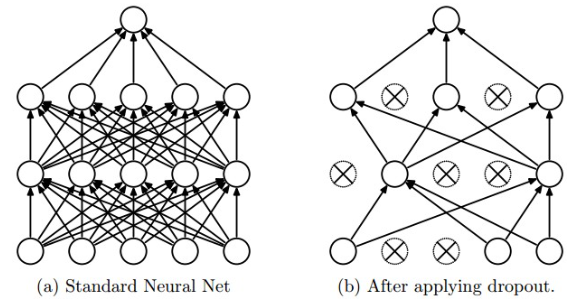

Recommended further reading for an interested reader includes:
- [Dropout paper by Srivastava et al. 2014.](https://www.cs.toronto.edu/~rsalakhu/papers/srivastava14a.pdf)
- [Dropout Training as Adaptive Regularization](https://proceedings.neurips.cc/paper_files/paper/2013/file/38db3aed920cf82ab059bfccbd02be6a-Paper.pdf): “we show that the dropout regularizer is first-order equivalent to an L2 regularizer applied after scaling the features by an estimate of the inverse diagonal Fisher information matrix”.

**Theme of noise in forward pass.** Dropout falls into a more general category of methods that introduce stochastic behavior in the forward pass of the network. During testing, the noise is marginalized over analytically (as is the case with dropout when multiplying by p), or numerically (e.g. via sampling, by performing several forward passes with different random decisions and then averaging over them). An example of other research in this direction includes DropConnect, where a random set of weights is instead set to zero during forward pass. As foreshadowing, Convolutional Neural Networks also take advantage of this theme with methods such as stochastic pooling, fractional pooling, and data augmentation. We will go into details of these methods later.

**Bias regularization**. As we already mentioned in the Linear Classification section, it is not common to regularize the bias parameters because they do not interact with the data through multiplicative interactions, and therefore do not have the interpretation of controlling the influence of a data dimension on the final objective. However, in practical applications (and with proper data preprocessing) regularizing the bias rarely leads to significantly worse performance. This is likely because there are very few bias terms compared to all the weights, so the classifier can “afford to” use the biases if it needs them to obtain a better data loss.

**Per-layer regularization**. It is not very common to regularize different layers to different amounts (except perhaps the output layer). Relatively few results regarding this idea have been published in the literature.

**In practice**: It is most common to use a single, global L2 regularization strength that is cross-validated. It is also common to combine this with dropout applied after all layers. The value of p=0.5 is a reasonable default, but this can be tuned on validation data.

Summary:
- Use ReLU
- Subtract mean for preprocessing of imagesUse Xavier init for weight initialization
- Use Batch normalization
- Bbaysit the learning process
- Perform hyper parameter optimization

Checkout ReLU variants like ELU, leaky ReLU, ...

### Mini batch SGD
Loop:
- Sample a batch of data
-  Forward prop it through graph
  - Get loss
- Back prop to calculate gradients
- Update the parameters using the gradients

**Basic view of training a NN:**
```
while True:
  data_batch = dataset.sample_data_batch()
  loss = network.forward(data_batch)
  dx = network.backward()
  x += - learning_rate * dx
```
